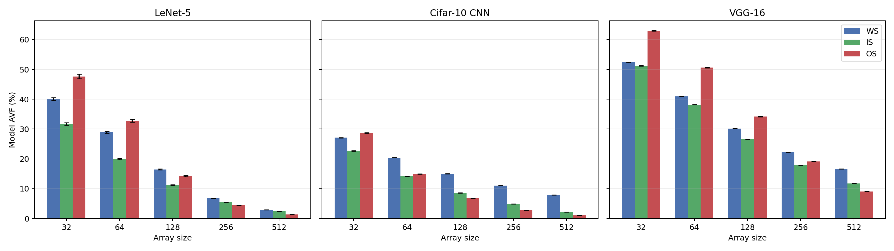
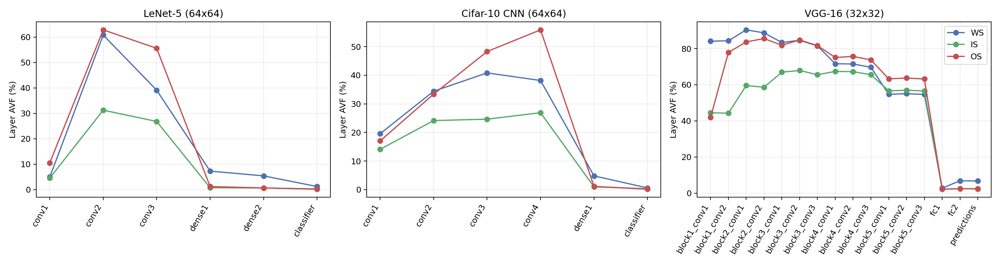
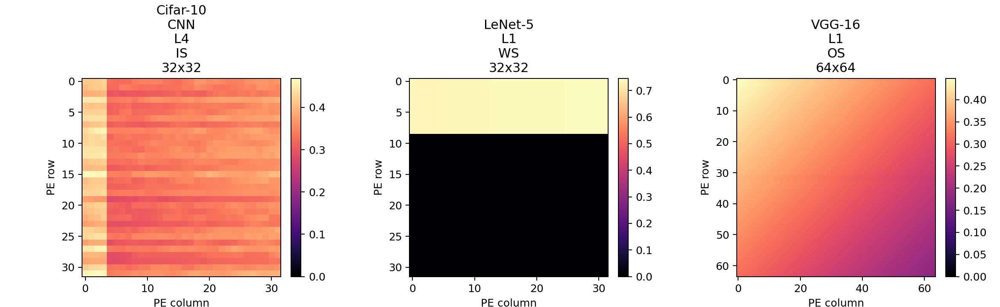

# saca-AVF 论文复现报告

论文：Tan et al., *Saca-AVF: A Quantitative Approach to Analyze the Architectural Vulnerability Factors of CNN Accelerators*, IEEE TC 2023.

复现代码：`sacaavf/`（纯 Python/numpy + Keras 取真实激活值），设计说明见 `SPEC.md`，结果在 `results/`。

---

## 1. AVF 到底是什么（先说人话）

芯片里的寄存器会被宇宙射线/粒子打中，某一位 0↔1 翻转，这叫 **软错误（soft error）**。
但不是每次翻转都会出事：如果翻转的那一位当时**没人用**，或者**马上被覆盖**，结果照样正确。

**AVF（Architectural Vulnerability Factor，架构脆弱因子）** 就回答一个问题：

> 在这个硬件结构里随机翻一位，最终输出出错的概率是多少？

Mukherjee (2003) 给的计算方法叫 **ACE 分析**：
- 某一位在某一周期，如果它的值**会影响最终输出**，就叫 **ACE 位**（Architecturally Correct Execution 必需的位）；否则叫 **un-ACE 位**。
- 于是

  \[
  \text{AVF} = \frac{\sum_{\text{周期}} \text{ACE 位数}}{\text{总位数} \times \text{总周期数}}
  \]

  即"ACE 位在时间-空间上的占比"。AVF = 30% 就意味着：一次随机单粒子翻转有 30% 概率让结果出错。

一个直观理解：**AVF ≈ 有用数据在寄存器里"驻留"的时间占比**。数据越多、待得越久、被复用得越多，AVF 越高。

## 2. 论文把 ACE 分析搬到 CNN 加速器上（saca-AVF）

CPU 上 ACE 分析靠指令语义（NOP、死指令）。脉动阵列（systolic array）没有指令，每个 PE 只做 MAC（乘加），
每个 PE 有 3 个 32 位寄存器：`ifmap`（输入激活）、`weight`（权重）、`psum`（部分和）。论文的规则：

| 情况 | ACE 位 | 原因 |
|---|---|---|
| 寄存器空闲（PE 没在用 / 阵列没铺满） | 无 | 翻了也没人读 |
| 预存（pre-store）阶段权重已进入 PE | weight | 之后要参与计算 |
| MAC 时 ifmap≠0, weight≠0 | 三个都是 | 都影响结果 |
| MAC 时 ifmap=0 | ifmap, psum | weight 乘 0 被**直接屏蔽** |
| MAC 时 weight=0 | weight, psum | ifmap 被屏蔽 |
| MAC 时两者都 0 | psum | 只有 psum 会往下传 |

关键洞察：CNN 里 **ReLU 之后有大量 0**，乘 0 的那一路数据翻转不影响结果 → 是 un-ACE。所以 AVF 由两件事决定：

1. **架构侧**：阵列多大、用哪种数据流（WS / IS / OS）、PE 利用率、执行周期数；
2. **模型侧**：激活值/权重里 0 的比例（每层、每张图都不同）。

saca-AVF 就是把整个网络推理过程中所有 PE、所有寄存器、每个周期的 ACE 位数加起来，除以 `3 × 32 × PE 数 × 总周期`。

## 3. 我们怎么复现的

论文没开源。我们没有直接改 SCALE-SIM，而是按 SCALE-SIM 的数据流时序模型自己写了两套等价实现：

- `sacaavf/cyclesim.py`：**逐周期字面模拟**，真的把数据每周期挪一格、做 MAC、按上表逐 PE 标 ACE，并验证算出来的 `O == I @ W`（证明数据流建模是对的）。
- `sacaavf/analytic.py`：**闭式计数**（同一时序模型推导出的公式），快几个量级，用于全部实验。
- `tests/`：两套实现在随机矩阵、2×2 到 5×5 阵列、三种数据流下**周期数、ACE 总数、每 PE ACE、每寄存器 ACE 全部精确相等**（10 个测试全过）。

数据流建模（每周期数据走一格，psum 竖向累加）：

- **WS**：权重按 K×M 分块预存（kh 个周期），ifmap 行从左流入，PE(i,j) 在第 n+i+j 周期处理第 n 行。
- **IS**：与 WS 对称，ifmap 预存，权重流入。
- **OS**：无预存，PE(i,j) 累加 O[n_i, m_j]，ifmap 从左、weight 从上同时流入。

模型与数据（Keras/TensorFlow-CPU，8 核）：

| 模型 | 结构 | 数据 | 精度 |
|---|---|---|---|
| LeNet-5（论文变体：第一层 3×3×32） | conv32-conv64-pool-conv64-pool-fc128-fc84-fc10 | MNIST 测试集 100 张 | 98.66% |
| Cifar-10 CNN | Keras 示例：conv32×2-pool-conv64×2-pool-fc512-fc10 | CIFAR-10 测试集 100 张 | 73.28% |
| VGG-16 | Keras ImageNet 预训练权重 | 20 张自然图像（见下方偏差说明） | — |

每张图逐层取**真实激活值**做 im2col 得到 `I (N×K)`、`W (K×M)`，测试保证 `I@W + b` 与 Keras 该层输出一致。
扫参：3 种数据流 × 5 种阵列（32…512）× 3 模型，全跑一遍约 6 分钟。

## 4. 结果

### 4.1 模型级 AVF（对应论文 Fig. 6）— `results/fig6.png`



与论文可直接对照的数字（Cifar-10 CNN, OS）：

| 阵列 | 论文 | 我们 |
|---|---|---|
| 32×32 | 34.8% | 28.7% |
| 64×64 | 20.9% | 14.9% |
| 128×128 | 8.7% | 6.8% |
| 256×256 | 3.3% | 2.8% |
| 512×512 | 1.0% | 1.07% |

**趋势完全一致**：阵列越大 AVF 越低（512×512 时 Cifar-10 只剩 ~1%），量级一致；在小阵列（32/64）我们低 6 个百分点，
原因主要是网络结构不完全相同（论文 Table III 是图片，无法提取；其 Cifar-10 CNN 至少 9 层）以及 0 的比例受训练影响。

论文的第二个结论 "OS > IS > WS" 在**小阵列下成立**（三模型的 32×32、64×64 都是 OS 最高），但在大阵列下反转：
256/512 时 WS/IS ≥ OS。这是**有解释的**（见 §5），不是 bug。

### 4.2 逐层 AVF（对应 Fig. 12）— `results/fig12.png`



论文说的现象全部重现：
- **CONV 层远高于 FC 层**。LeNet-5 WS 64×64：conv2 = 60.8%，最后 FC = 1.2%（论文：46.1% / 0.6%）。
- LeNet-5 第 2 层最脆弱（计算量约为第 1 层的 20 多倍，psum 驻留久）。
- 越靠后的层 0 越多 → AVF 越低；VGG-16 三个 FC 层掉到 ~2–7%。

### 4.3 PE 级 AVF 热图（对应 Fig. 11）— `results/fig11.png`



- **LeNet-5 L1, WS, 32×32**：第一层 K = 3×3×1 = 9，只用到 9 行 PE，其余 23 行 AVF = 0（空闲 PE 不脆弱）。论文同样描述"只有用到的 PE 非零"。
- **Cifar-10 L4, IS, 32×32**：预存的是 ifmap，ReLU 后的 0 随机分布 → 低 AVF 的 PE 随机分布（论文原话）。
- **VGG-16 L1, OS, 64×64**：无预存、数据同时流入，分布平滑，左上角略高（先开始累加、psum 驻留久）。

### 4.4 每个寄存器贡献多少 ACE — `results/ace_by_reg.csv`

Cifar-10 CNN：

| 阵列 | 数据流 | ifmap | weight | psum |
|---|---|---|---|---|
| 32 | WS | 29% | 42% | 29% |
| 32 | IS | 57% | 15% | 27% |
| 32 | OS | 37% | 21% | 42% |
| 512 | WS | 7% | **87%** | 7% |
| 512 | IS | **88%** | 4% | 7% |
| 512 | OS | 29% | 16% | 56% |

这张表就是理解 AVF 的钥匙：**谁在寄存器里待得久，谁就是脆弱源**。

## 5. 从数字里学到的（以及与论文不一致处的解释）

1. **AVF 本质是"有用数据 × 驻留时间"**。大阵列上单层执行更快、又有很多 PE 空闲，所以 AVF 下降；这与论文 Fig. 7 一致（我们 PE 利用率与 AVF 强相关，例如 LeNet WS 利用率 98%→15%）。
2. **psum 永远是 ACE**（部分和翻一位一定加进最终结果），所以任何"跳 0"优化都只能降一部分 AVF——论文 §V-D 的结论。
3. **大阵列下 WS/IS 反超 OS 的原因**：WS/IS 有**预存 + 驻留**——权重（或 ifmap）在 PE 里从预存开始一直坐到该 tile 结束。
   阵列 512×512 时一个 FC 层的 tile 预存要 512 周期，而真正的 MAC 只有 1 行（N=1），寄存器里 87% 的 ACE 全是"坐着等"的权重。
   OS 没有预存，大阵列时数据"过一下就走"。论文中 WS 最低，可能是他们的 SCALE-SIM 扩展只在 MAC 周期计权重 ACE，或 FC 层
   ifmap 更稀疏；我们按论文 Fig. 4 的字面规则（预存即 ACE，但乘 0 屏蔽）建模。这个差异恰好说明：**AVF 结果对"寄存器何时算被使用"的
   定义非常敏感**，这是做 ACE 分析时最需要明确的假设。
4. **早期 CONV 层要重点保护**（选择性冗余/ECC 只加在前几层和 psum 上最划算）——与论文 Summary 一致。

## 6. 与论文的已知偏差

| 项目 | 论文 | 本复现 | 影响 |
|---|---|---|---|
| 仿真器 | 扩展 SCALE-SIM | 按 SCALE-SIM 时序自写（双实现互验） | 周期数常数项可能差 O(阵列边长) |
| Cifar-10 CNN 结构 | 未知（≥9 层） | Keras 示例 6 个 MAC 层 | 小阵列 AVF 低 ~6pp |
| VGG-16 输入 | ImageNet 验证集 100 张 | CIFAR-10 放大到 224 的 20 张（无 ImageNet 访问权） | 只影响 0 的分布，趋势不变 |
| 预存权重 ACE | Fig.4：全算 ACE | 全算 ACE，但**永远只乘 0 的权重**按论文 §III-A 屏蔽规则算 un-ACE | 否则 FC 层 AVF 会虚高到 8% |
| 故障注入验证（§V-F） | 3000 次注入 | 未做 | 可作为下一步 |

## 7. 如何复跑

```bash
pip install -r requirements.txt
python -m pytest -q                 # 双实现互验 + 层矩阵正确性
python -m sacaavf.run               # 训练/下载模型并跑完整扫参，输出到 results/
```
